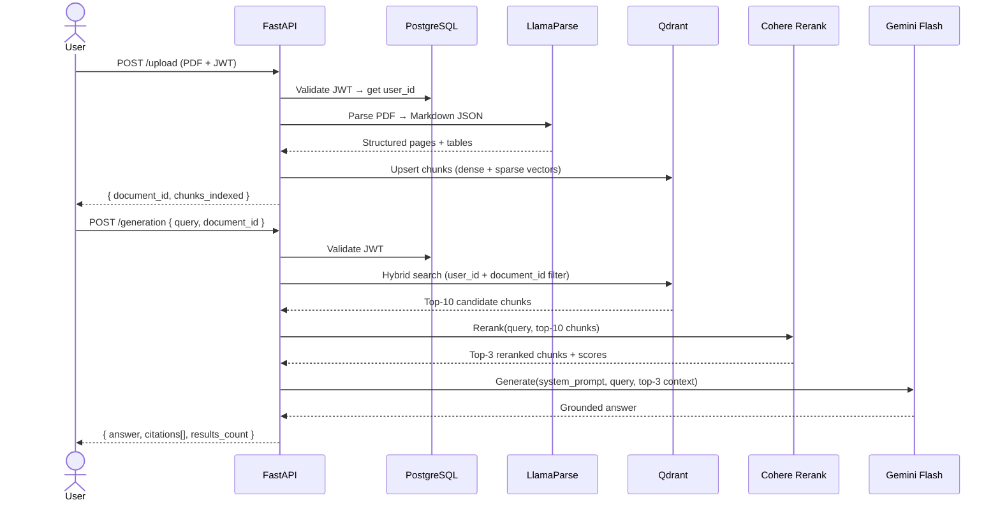

<div align="center">

<br/>

```
  ██████╗██╗  ██╗ █████╗ ████████╗██████╗ ██████╗ ███████╗    ██████╗ ██████╗  ██████╗
 ██╔════╝██║  ██║██╔══██╗╚══██╔══╝██╔══██╗██╔══██╗██╔════╝    ██╔══██╗██╔══██╗██╔═══██╗
 ██║     ███████║███████║   ██║   ██████╔╝██║  ██║█████╗      ██████╔╝██████╔╝██║   ██║
 ██║     ██╔══██║██╔══██║   ██║   ██╔═══╝ ██║  ██║██╔══╝      ██╔═══╝ ██╔══██╗██║   ██║
 ╚██████╗██║  ██║██║  ██║   ██║   ██║     ██████╔╝██║         ██║     ██║  ██║╚██████╔╝
  ╚═════╝╚═╝  ╚═╝╚═╝  ╚═╝   ╚═╝   ╚═╝     ╚═════╝ ╚═╝         ╚═╝     ╚═╝  ╚═╝ ╚═════╝
```

### A production-grade multimodal RAG system with Hybrid Search + Neural Reranking

<br/>


<br/>

[Features](#-features) · [Architecture](#-architecture) · [Tech Stack](#-tech-stack) · [Quick Start](#-quick-start) · [API Reference](#-api-reference) · [Design Decisions](#-design-decisions)

<br/>

</div>

---

## What is ChatPDF Pro?

ChatPDF Pro is a **multimodal Retrieval-Augmented Generation (RAG) system** that lets authenticated users upload PDF documents and ask natural-language questions about their content — with accurate, cited, hallucination-resistant answers.

Unlike most RAG tutorials that chain together a text splitter and an embedding model, this system implements a **two-stage hybrid retrieval pipeline** that mirrors the architecture used by production AI search systems:

1. **Hybrid retrieval** — combines dense semantic search (Gemini embeddings) with sparse keyword search (BM25) inside a single Qdrant query, outperforming either method alone on both recall and precision.
2. **Neural reranking** — passes the top-10 retrieved chunks through Cohere's cross-encoder model, which reads the query and each chunk together (rather than independently), re-scoring them to surface the 3 most contextually relevant passages.

The result: answers that are grounded in the actual document, accurate at a sentence level, and annotated with page-level citations.

---

## ✨ Features

| Category | What it does |
|---|---|
| **Hybrid Search** | Combines dense (Gemini 3072-dim) + sparse (BM25) retrieval in a single Qdrant query for higher recall than vector-only approaches |
| **Neural Reranking** | Cohere `rerank-v3.5` cross-encoder re-scores retrieved chunks in query context, cutting noise before generation |
| **Multimodal Parsing** | LlamaParse converts PDFs to structured Markdown, preserving tables, headers, and detected figures with page numbers |
| **Multi-tenancy** | Every Qdrant query is filtered by `user_id` + `document_id` — one user can never retrieve another's data |
| **Secure Auth** | JWT Bearer tokens + Argon2 password hashing (the current OWASP-recommended algorithm) |
| **Citation-aware** | Every answer is returned with chunk-level citations: source, page number, and relevance ranking |
| **Clean REST API** | FastAPI with auto-generated OpenAPI docs, Pydantic v2 validation, and proper HTTP status codes |
| **Docker-ready** | Multi-stage Dockerfile with pre-baked BM25 model, non-root user, health check, and named volumes |

---

## 🏗️ Architecture

### Ingestion Pipeline

```
PDF File
   │
   ▼
┌──────────────────────────────┐
│  LlamaParse Cloud API        │  → Converts PDF to structured Markdown.
│  (result_type="json")        │    Preserves tables, headers, detected
└──────────────────────────────┘    figures, and page numbers.
   │
   ▼
┌──────────────────────────────┐
│  MarkdownHeaderTextSplitter  │  → Splits on H1/H2/H3 boundaries.
│  (LangChain)                 │    Each chunk inherits its section header
└──────────────────────────────┘    as metadata, preserving context.
   │
   ▼
┌──────────────────────────────┐    Dense:  Gemini embedding-001 (3072-dim)
│  Hybrid Indexing → Qdrant    │    Sparse: FastEmbedSparse BM25
│  collection: chatypdf        │    Filter: user_id + document_id
└──────────────────────────────┘    Storage: local SQLite (dev) / Cloud (prod)
```

### Retrieval & Generation Pipeline

```
User Query
   │
   ▼
┌──────────────────────────────┐
│  Hybrid Search (Qdrant)      │  → Runs dense + sparse search simultaneously.
│  top_k=10                    │    Qdrant fuses scores via Reciprocal Rank
│  filter: user_id+document_id │    Fusion (RRF) before returning candidates.
└──────────────────────────────┘
   │  10 candidate chunks
   ▼
┌──────────────────────────────┐
│  Cohere Rerank v3.5          │  → Cross-encoder reads query + each chunk
│  top_n=3                     │    together. Unlike bi-encoders, it directly
└──────────────────────────────┘    models their interaction. Best 3 survive.
   │  3 reranked chunks
   ▼
┌──────────────────────────────┐
│  Prompt Assembly             │  → Context blocks labeled [Chunk N] with
│  + Gemini Flash LLM          │    Source / Page / Content. System prompt
│                              │    enforces citation and groundedness rules.
└──────────────────────────────┘
   │
   ▼
Answer + Citations (chunk label, source, page)
```

### End-to-End Sequence



---

## 🛠️ Tech Stack

| Layer | Technology | Why this choice |
|---|---|---|
| **API** | FastAPI 0.115 | Async-native, auto-generated OpenAPI docs, dependency injection for auth |
| **PDF Parsing** | LlamaParse | Superior to PyPDF2/pdfplumber — preserves table structure and layout |
| **Chunking** | LangChain `MarkdownHeaderTextSplitter` | Structure-aware splitting retains semantic context better than character chunking |
| **Dense Embeddings** | Google Gemini `embedding-001` (3072-dim) | State-of-the-art multilingual embeddings, strong on technical documents |
| **Sparse Embeddings** | FastEmbedSparse BM25 | Keyword recall for exact terms, acronyms, and proper nouns that dense models miss |
| **Vector Store** | Qdrant | Native hybrid search (RRF fusion), metadata filtering, production Kubernetes support |
| **Reranking** | Cohere `rerank-v3.5` | Cross-encoder beats bi-encoder scoring by modelling query-chunk interaction jointly |
| **LLM** | Google Gemini Flash | Fast, cost-efficient, 1M token context window for large document handling |
| **Auth** | JWT + `python-jose` | Stateless, horizontally scalable, standard OAuth2 Bearer pattern |
| **Password Hashing** | Argon2 (argon2-cffi) | OWASP's current top recommendation, memory-hard by design |
| **ORM** | SQLAlchemy 2.0 + PostgreSQL | Mature, type-safe, battle-tested for user and document management |
| **Containerisation** | Docker multi-stage + Compose | Build-time compilation isolated from lean runtime image |

---

## 🚀 Quick Start

### Prerequisites

- Python 3.13+
- Docker & Docker Compose (optional but recommended)
- API keys: [Google AI Studio](https://aistudio.google.com), [LlamaCloud](https://cloud.llamaindex.ai), [Cohere](https://dashboard.cohere.com)

### Option A — Docker (Recommended)

```bash
# 1. Clone the repo
git clone https://github.com/emxelux/Multimodal_RAG_System.git
cd Multimodal_RAG_System

# 2. Set up environment
cp .env.example .env
# Open .env and fill in your API keys

# 3. Start the stack (API + PostgreSQL)
docker compose up --build

# API is live at http://localhost:8000
# OpenAPI docs at http://localhost:8000/docs
```

### Option B — Local Development

```bash
# 1. Clone and enter the repo
git clone https://github.com/emxelux/Multimodal_RAG_System.git
cd Multimodal_RAG_System

# 2. Create a virtual environment
python -m venv .venv
source .venv/bin/activate   # Windows: .venv\Scripts\activate

# 3. Install dependencies
pip install -r requirements.txt

# 4. Configure environment
cp .env.example .env
# Open .env and fill in your API keys + DATABASE_URL

# 5. Run database migrations (PostgreSQL must be running)
python -c "from databases.database import Base, engine; Base.metadata.create_all(engine)"

# 6. Start the server
uvicorn app.main:app --host 0.0.0.0 --port 8000 --reload
```

---

## 📡 API Reference

Interactive documentation is auto-generated at **`http://localhost:8000/docs`** (Swagger UI).

### Authentication

All endpoints except `POST /users/` and `POST /login/` require a Bearer token in the `Authorization` header.

```
Authorization: Bearer <your_access_token>
```

---

### `POST /users/` — Register

Create a new user account.

**Request body**
```json
{
  "first_name": "Emmanuel",
  "last_name": "Doe",
  "email": "emmanuel@example.com",
  "phone_number": "+2348012345678",
  "password": "strongpassword123"
}
```

**Response `201 Created`**
```json
{
  "first_name": "Emmanuel",
  "last_name": "Doe",
  "email": "emmanuel@example.com",
  "phone_number": "+2348012345678",
  "is_verified": false,
  "created_at": "2026-06-24T10:00:00Z"
}
```

---

### `POST /login/` — Authenticate

Returns a JWT token. Uses OAuth2 `application/x-www-form-urlencoded` format.

**Request body (form data)**
```
username=emmanuel@example.com
password=strongpassword123
```

**Response `200 OK`**
```json
{
  "access_token": "eyJhbGciOiJIUzI1NiIsInR5cCI6IkpXVCJ9...",
  "token_type": "bearer"
}
```

---

### `POST /upload` — Upload PDF

Parse and index a PDF document. Returns a `document_id` that **must be stored by the client** and supplied on every subsequent query.

**Request** — `multipart/form-data`
```
file: <your_pdf_file.pdf>
```

**Response `200 OK`**
```json
{
  "status": "Successfully indexed and processed document",
  "document_id": "3fa85f64-5717-4562-b3fc-2c963f66afa6",
  "saved_path": "uploads/user123_docid_filename.pdf",
  "chunks_indexed": 47
}
```

> ⚠️ **Save `document_id`** — it is the handle for all future queries against this document.

---

### `POST /generation` — Ask a Question

Runs the full hybrid-retrieval + reranking + generation pipeline against a specific document.

**Request body**
```json
{
  "query": "What methodology was used in the study?",
  "document_id": "3fa85f64-5717-4562-b3fc-2c963f66afa6"
}
```

**Response `200 OK`**
```json
{
  "query": "What methodology was used in the study?",
  "document_id": "3fa85f64-5717-4562-b3fc-2c963f66afa6",
  "answer": "From page 4 in the document, the study employed a mixed-methods approach combining...",
  "citations": [
    { "chunk_label": "Chunk 1", "source_name": "report.pdf", "page": 4 },
    { "chunk_label": "Chunk 2", "source_name": "report.pdf", "page": 5 },
    { "chunk_label": "Chunk 3", "source_name": "report.pdf", "page": 4 }
  ],
  "results_count": 3
}
```

---

### `GET /` — Health Check

```json
{ "message": "ChatPDF backend is running" }
```

---

## 📁 Project Structure

```
Multimodal_RAG_System/
│
├── app/
│   ├── main.py                  # FastAPI app: /upload and /generation endpoints
│   └── routes/
│       ├── login.py             # POST /login/ — OAuth2 token issuance
│       └── users.py             # POST /users/ — registration
│
├── data_preprocessing/
│   ├── ingest.py                # LlamaParse PDF → Markdown JSON
│   ├── chunking.py              # MarkdownHeaderTextSplitter chunking
│   └── vector_db.py             # Qdrant upsert, hybrid retrieval, Cohere reranking
│
├── databases/
│   ├── database.py              # SQLAlchemy engine + session factory
│   ├── models.py                # User and Document ORM models
│   ├── schemas.py               # Pydantic request/response schemas
│   ├── oauth2.py                # JWT creation and verification
│   └── utils.py                 # Argon2 password hashing
│
├── llm/
│   └── ask_llm.py               # Gemini Flash generation function
│
├── prompts/
│   └── system_prompt.txt        # RAG system prompt with citation and grounding rules
│
├── Dockerfile                   # Multi-stage production build
├── docker-compose.yml           # API + PostgreSQL stack
├── requirements.txt             # Minimal, audited dependency list
├── .env.example                 # Safe environment variable template
└── .dockerignore                # Excludes secrets and runtime data from build context
```

---

## 🧠 Design Decisions

These are the questions a technical interviewer will ask. Here are the answers.

**Why hybrid search instead of pure vector search?**

Dense embeddings excel at semantic similarity but struggle with exact keyword recall — acronyms, model names, version numbers, and proper nouns are often handled poorly. BM25 excels at exactly these cases. By running both in parallel and fusing scores with Reciprocal Rank Fusion (RRF), the system gets the best of both retrieval paradigms. This is the same approach used by Elasticsearch, Vespa, and modern enterprise search systems.

**Why Cohere for reranking instead of just taking the top-K from retrieval?**

Bi-encoders (like the Gemini embedding model) encode the query and document independently and compare their dot products. This is fast but loses query-document interaction signal. A cross-encoder (like Cohere Rerank) reads both the query and each chunk together in a single forward pass, explicitly modelling their relationship. For a system where answer accuracy is the primary metric, the added latency (~200ms) is well worth the precision gain.

**Why LlamaParse over PyPDF2 or pdfplumber?**

PDF is a page-description format, not a document format. Native PDF parsers extract text character by character and lose table structure, column layout, and reading order. LlamaParse uses a vision-language model to understand document layout, extracting tables as proper Markdown tables and preserving section hierarchy. This dramatically improves chunk quality, which is the most important variable in RAG performance.

**Why Argon2 over bcrypt?**

Both are acceptable. Argon2 won the 2015 Password Hashing Competition and is the current OWASP recommendation. It is memory-hard (configurable), which makes GPU-based cracking attacks more expensive than bcrypt.

**Why a single Uvicorn worker?**

The local Qdrant instance uses SQLite as its storage backend. SQLite has a single-writer lock that is not safe across multiple OS processes. Using `--workers > 1` would cause each worker to hold a separate `lru_cache` instance and compete for the same file, risking data corruption. The correct path to horizontal scaling is migrating to Qdrant Cloud, at which point multiple workers (or a Kubernetes deployment) become safe and straightforward.

---

## 🗺️ Roadmap

- [ ] **Streaming responses** — `StreamingResponse` + SSE so answers appear token by token
- [ ] **Document persistence** — write to `documents` table on upload; add `GET /documents/` so the frontend can restore state without localStorage
- [ ] **Background ingestion** — `BackgroundTasks` for upload processing so the endpoint returns immediately
- [ ] **Conversation history** — pass prior turns to the LLM for true multi-turn dialogue
- [ ] **RAGAS evaluation** — measure `faithfulness`, `answer_relevancy`, and `context_precision` automatically on each response
- [ ] **Qdrant Cloud migration** — unlock multi-worker and containerised horizontal scaling
- [ ] **Multi-document querying** — query across all of a user's indexed documents simultaneously
- [ ] **Document deduplication** — hash-based detection of re-uploads using the existing `document_hash` column

---

## 🙋 Author

**Emmanuel** — AI Engineer

Building production-grade AI systems with a focus on retrieval quality, system design, and clean, explainable code.

[](https://github.com/emxelux)

---

## 📄 License

This project is licensed under the MIT License. See [LICENSE](LICENSE) for details.

---

<div align="center">

*If this project was useful or interesting, a ⭐ on GitHub is appreciated.*

</div>
